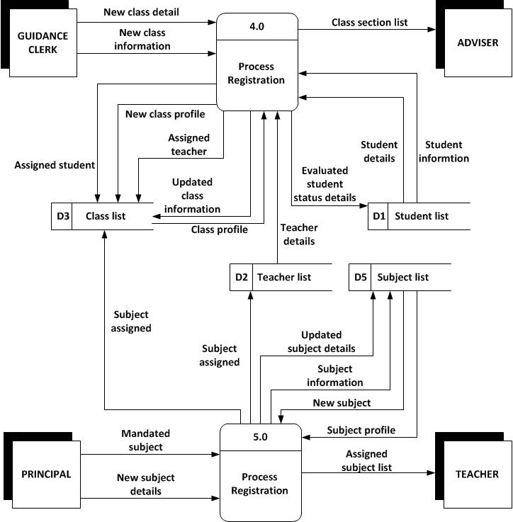
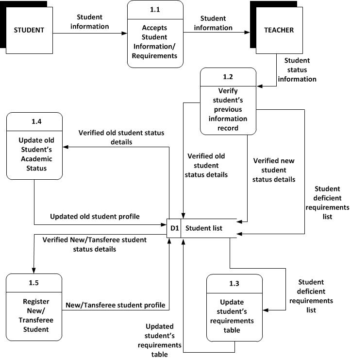
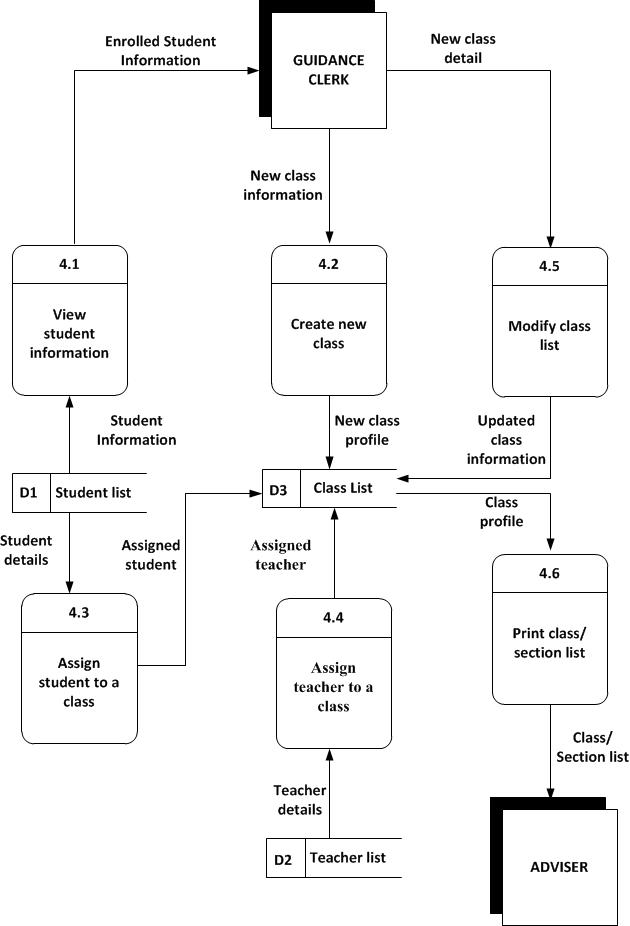
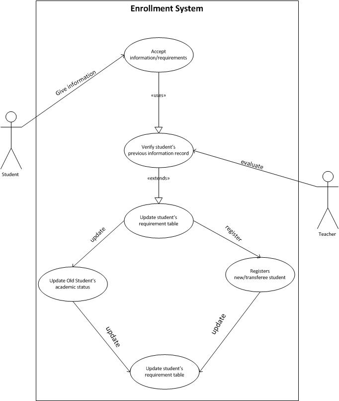

### A. Context Diagram

### B. Diagram 0

* Illustration A

  

* Illustration B

### C. Lower-Level Diagrams

* Enrollment System

   

* Profiling System

   

* Grading System

   

* Class Management System

   

* Subject Management System

   

### D. Use Case Diagrams

* Enrollment System

   

* Profiling System

   

* Grading System

   

* Class Management System

   

* Subject Management System

  