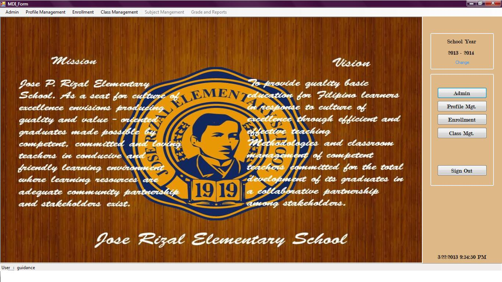
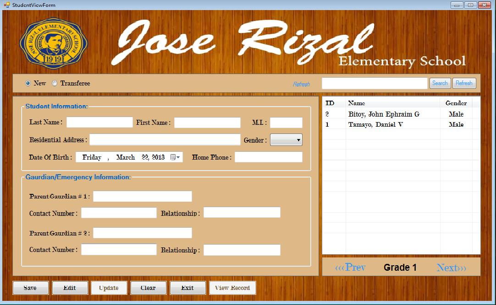
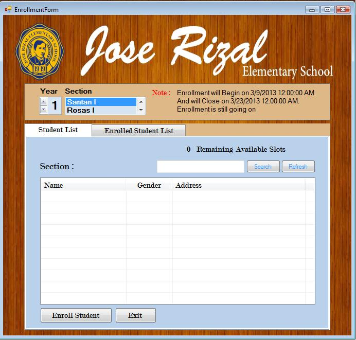
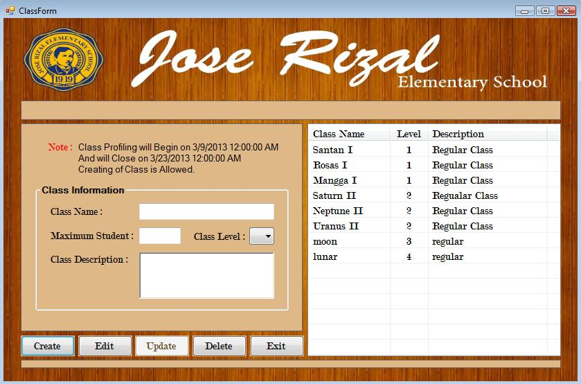
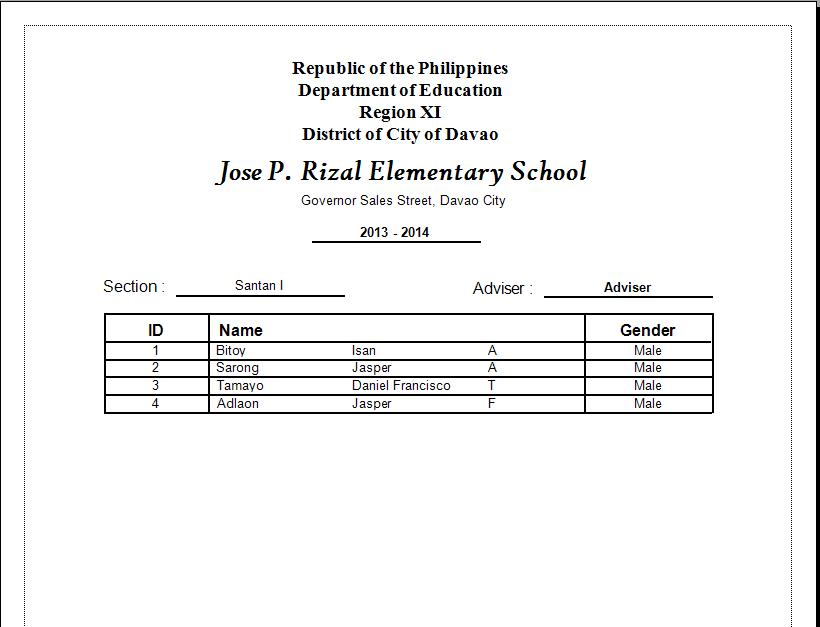
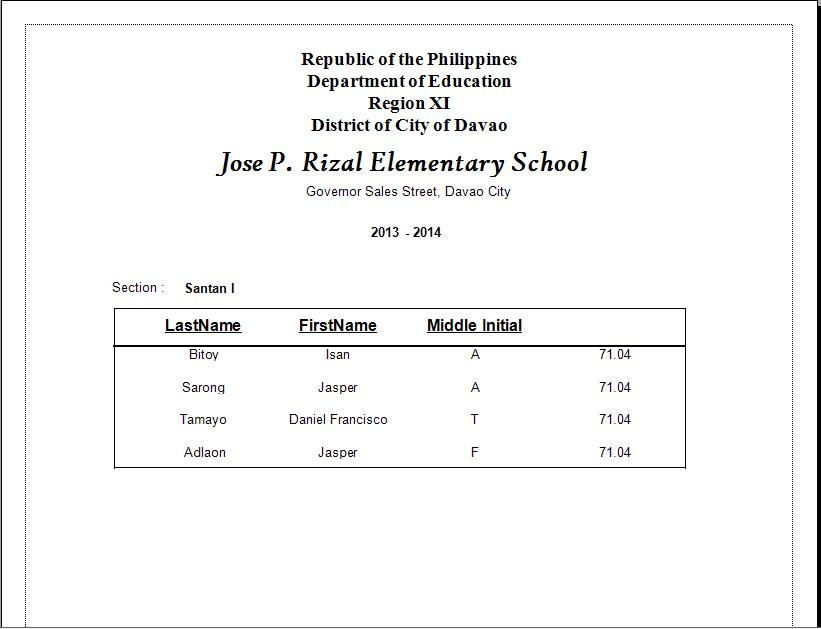
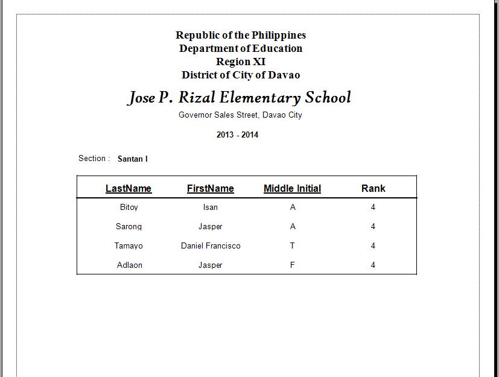

## MDI Form
Where all the menu buttons and menu tabs can be found

## Module 1 

### Student Profile Form
Where the user can add, edit, update and view student's information record

  

### Teacher Profile Form
The user can add, edit, update teacher's information record and add teacher's credentials

  

### Enroll Student Form
Enroll to a class and unenroll student from the class

  

### Create Class Form
Create, edit, and update class information record 

  

## Module 2

### Add Subject Form
Add, edit, and update subject information record

  

### Subject Assign to Teacher Form
Assign/reassign subject, special subjects to a specific teacher

  

### Subject Assign to Class Form
Assign/reassign subject and subject schedule to a class

  

### Teacher Assign to Class Form
Assign/reassign teacher to a class

  

### View Class List
View the enrolled students and assigned subjects and its corresponding subject and teacher

  

## Module 3

### Student Grade Form
The user can update the student's subject grade

  

### Student Evaluation Form
Promote student to the next year level

  

### Student Attendance Form
The user can input student's attendance record

  

### Graduate List Form
A list where the user can retrieve student's graduating list

  

## Printed Outputs

### Student List
Print all profiled students

  

### Teacher List
Print all profiled teachers

  

### Class List
Print the enrolled students from a specific class

  

### Failed Student List
Print all failed students from a specific class

  

### Honor List
Print all honor students in a specific class

  

### Section Grade List
Print all the students grade

  
