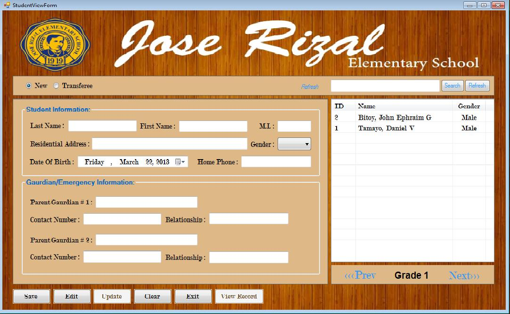
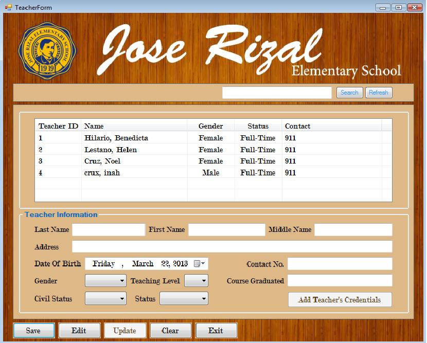
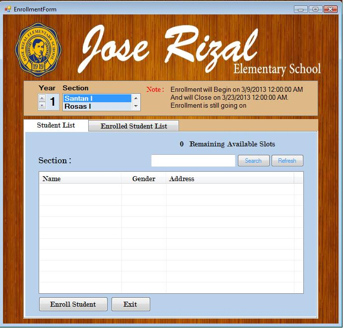
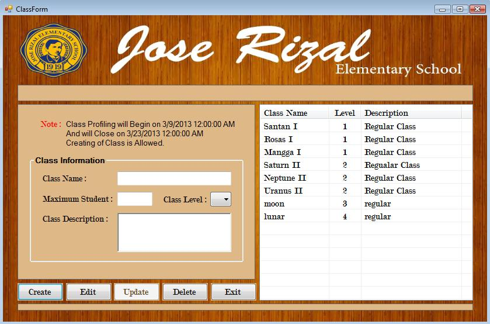

### Student Profile Form
Where the user can add, edit, update and view student's information record

  

### Teacher Profile Form
The user can add, edit, update teacher's information record and add teacher's credentials

  

### Enroll Student Form
Enroll to a class and unenroll student from the class

  

### Create Class Form
Create, edit, and update class information record 

  