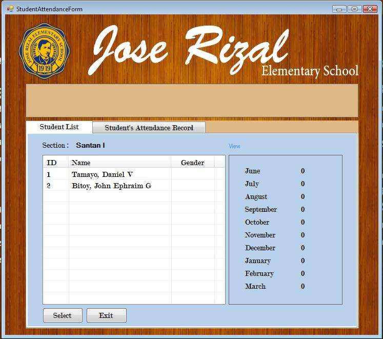
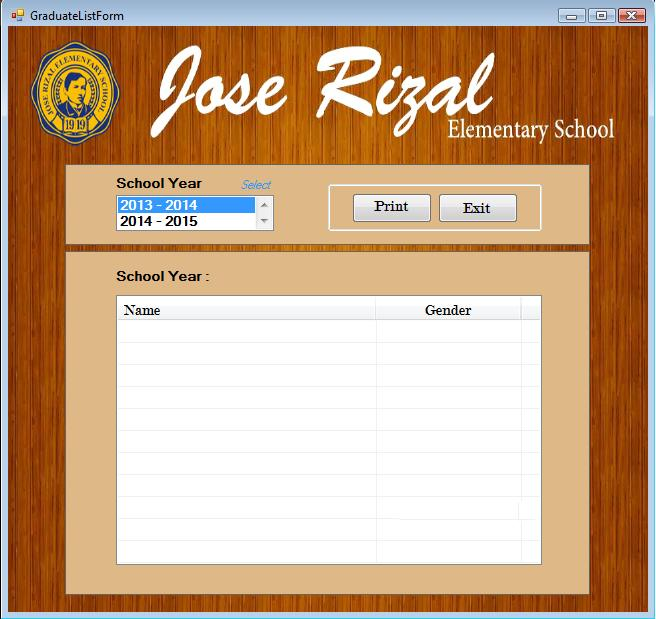

### Student Grade Form
The user can update the student's subject grade

  

### Student Evaluation Form
Promote student to the next year level

  

### Student Attendance Form
The user can input student's attendance record

  

### Graduate List Form
A list where the user can retrieve student's graduating list

  